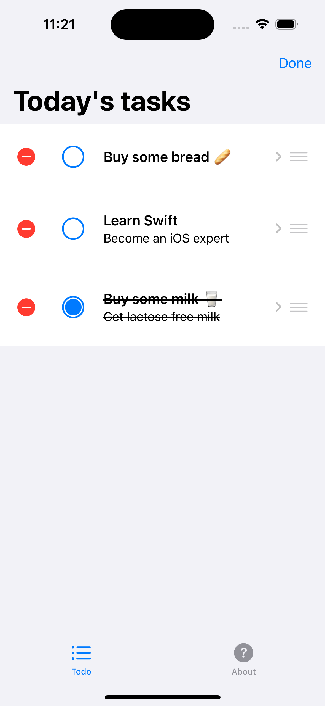
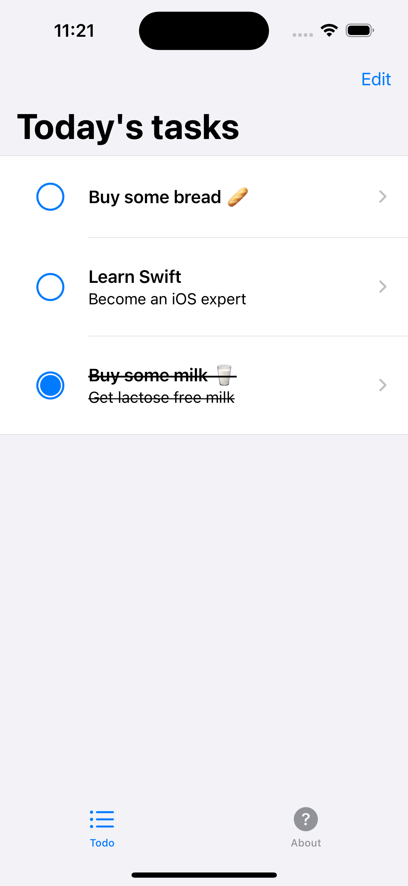

# ToDo App

The ToDo app is a Swift-based application designed to help users manage their tasks efficiently. It leverages the power of SwiftUI to provide a seamless and intuitive user interface, allowing edit, and delete tasks. The app follows the MVVM architecture pattern to ensure a scalable and maintainable codebase.

## Key Features:

- **Task Management**: Create, update, and delete tasks effortlessly.
- **Intuitive UI**: A clean and user-friendly interface built with SwiftUI.
- **Localization**: Supports multiple languages to cater to a global audience.
- **Form-Based Editing**: Easily edit task details using form elements that adapt to the full width of the screen.

## Technical Highlights:

- **SwiftUI**: Utilizes SwiftUI for building responsive and interactive UIs.
- **MVVM Architecture**: Ensures separation of concerns and promotes a maintainable code structure.
- **Combine Framework**: Implements reactive programming to handle asynchronous events and data updates.

## Getting Started:

### Clone the Repository:
```bash
git clone https://github.com/yourusername/todo-app.git
cd todo-app
Open in Xcode:
Open the .xcodeproj file in Xcode.
Ensure you have the latest version of Xcode installed.
Run the App:
Select your target device or simulator.
Click on the Run button or press Command + R.




